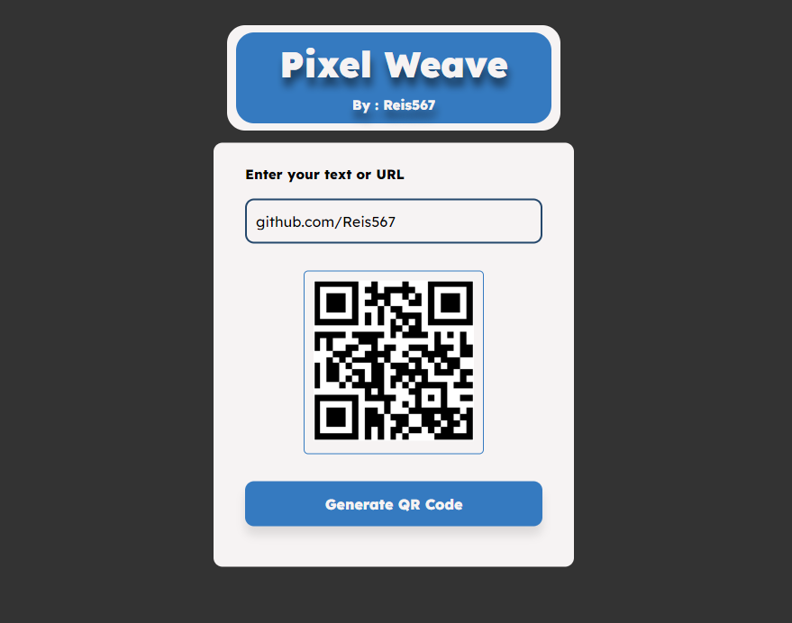

# Pixel Weave
Portuguese version at the end

Pixel Weave is a simple web application that allows users to generate QR codes from text or URLs. This application utilizes the third-party API [QRServer](https://api.qrserver.com/) to efficiently create QR codes. You can use this application to create custom QR codes for quick and convenient information sharing.

## How to Use

1. Open the `index.html` file in your web browser.

2. In the "Enter your text or URL" section, input the text or URL that you want to turn into a QR code.

3. Click the "Generate QR Code" button to create the corresponding QR code.

4. The generated QR code will be displayed in the image box below the input field.

5. You can right-click on the QR code image to save it to your device or use it as needed.

## Interface Style

The project features an attractive interface style with a predominantly blue color scheme. Here are some style highlights:

- Custom 'Lexend' font for a unique appearance.
- The title "Pixel Weave" is prominently displayed with text shadow.
- The author's name, "Reis567," is linked to their GitHub profile.
- The "Generate QR Code" button is the central piece of functionality.

## Project Structure

The project consists of three main components:

- `index.html`: The main HTML file that defines the page's structure.
- `style.css`: The CSS file that styles the page and makes it visually appealing.
- `app.js`: The JavaScript file that controls the QR code generation functionality.

## Customization

You can customize the appearance and behavior of this project by editing the `style.css` file to adjust colors, fonts, and styles to your preferences. Additionally, you can modify the `app.js` file to add additional functionality or improvements to the application.

## Credits

- Developed by [Reis567](https://github.com/Reis567)
- Utilizes the [QRServer](https://api.qrserver.com/) API for QR code generation.

---

This project is a simple and effective way to generate custom QR codes for use in various contexts. Feel free to make changes or improvements according to your specific needs. If you have any questions or encounter issues, don't hesitate to contact the developer on GitHub.

### Português

# Pixel Weave

Pixel Weave é uma aplicação web simples que permite aos usuários gerar códigos QR a partir de texto ou URLs. Esta aplicação utiliza a API de terceiros [QRServer](https://api.qrserver.com/) para criar os códigos QR de forma eficiente. Você pode usar esta aplicação para criar códigos QR personalizados para compartilhar informações de maneira rápida e conveniente.

## Como Usar

1. Abra o arquivo `index.html` em seu navegador da web.

2. Na seção "Enter your text or URL", insira o texto ou a URL que deseja transformar em um código QR.

3. Clique no botão "Generate QR Code" para criar o código QR correspondente.

4. O código QR gerado será exibido na caixa de imagem abaixo do campo de entrada.

5. Você pode clicar com o botão direito na imagem do código QR para salvá-lo no seu dispositivo ou usá-lo como desejar.

## Estilo da Interface

O projeto possui um estilo de interface atraente, com um esquema de cores predominantemente azul. Aqui estão algumas das características de estilo:

- Fonte de texto personalizada 'Lexend' para uma aparência única.
- O título "Pixel Weave" é exibido em grande destaque com sombreamento de texto.
- O nome do autor, "Reis567," está vinculado ao perfil GitHub.
- O botão "Generate QR Code" é a peça central da funcionalidade.

## Estrutura do Projeto

O projeto é composto por três principais componentes:

- `index.html`: O arquivo HTML principal que define a estrutura da página.
- `style.css`: O arquivo CSS que estiliza a página e torna-a atraente.
- `app.js`: O arquivo JavaScript que controla a funcionalidade de geração de código QR.

## Personalização

Você pode personalizar a aparência e o comportamento deste projeto editando o arquivo `style.css` para ajustar as cores, fontes e estilos de acordo com suas preferências. Além disso, você pode modificar o arquivo `app.js` para adicionar funcionalidades adicionais ou melhorias à aplicação.

## Créditos

- Desenvolvido por [Reis567](https://github.com/Reis567)
- Utiliza a API [QRServer](https://api.qrserver.com/) para a geração de códigos QR.

---

Este projeto é uma maneira simples e eficaz de gerar códigos QR personalizados para uso em diversos contextos. Sinta-se à vontade para fazer alterações ou melhorias de acordo com suas necessidades específicas. Se tiver alguma dúvida ou encontrar problemas, não hesite em entrar em contato com o desenvolvedor no GitHub.
